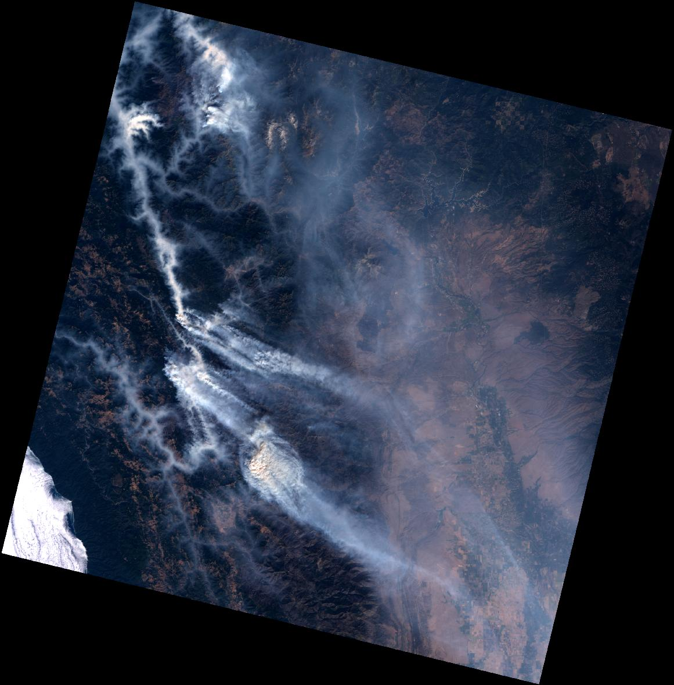
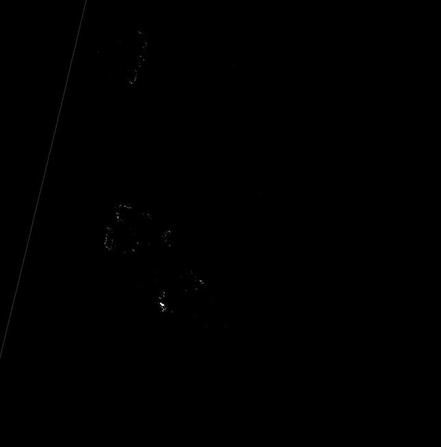

# Landsat-8: Fire mask
A tool for generating a binary fire mask (1: fire, 0: no-fire) from a Landsat-8 scene.

## Build image
```bash
docker build -t landsat8-fire-mask .
```

## Usage
Generate a binary fire mask given for a Landsat-8 scene given 1) path to band number 5, 2) path to band number 7, and 3) path to output directory. Generated fire mask is stored in `<output_path>/binary_fire_mask.TIF`

```bash
docker run --rm -it \
      -v `pwd`:/workspace landsat8-fire-mask python3 src/fire_mask.py \
      --help
```

```
usage: fire_mask.py [-h] -b5 BAND_FIVE -b7 BAND_SEVEN [-o OUTPUT_DIRECTORY]

optional arguments:
  -h, --help            show this help message and exit
  -b5 BAND_FIVE, --band_five BAND_FIVE
                        path to band number 5
  -b7 BAND_SEVEN, --band_seven BAND_SEVEN
                        path to band number 7
  -o OUTPUT_DIRECTORY, --output_directory OUTPUT_DIRECTORY
                        Path to putput directory. Default is output/.
```

**Example**: Generating a binary fire mask for scene *LC08_L1TP_045032_20201003_20201015_01_T1*:

Input scene: 

Generated fire mask: 

First, download L8 scene:
```bash
aws s3 sync s3://landsat-pds/c1/L8/045/032/LC08_L1TP_045032_20201003_20201015_01_T1/ tests/data/
```

Then, generate fire mask for scene:
```bash
docker run --rm -it \
      -v `pwd`:/workspace \
      landsat8-fire-mask python3 src/fire_mask.py \
      --band_five tests/data/*_B5.TIF \
      --band_seven tests/data/*_B7.TIF \
      --output_directory output
```

## Linting
Autopep8
```bash
docker run \
    --rm -it \
    -v `pwd`:/workspace \
    landsat8-fire-mask /bin/bash -c \
        "pip3 install -r requirements-dev.txt && \
        autopep8 -i -a -a -r ."
```

Flake8
```bash
docker run \
    --rm -it \
    -v `pwd`:/workspace \
    landsat8-fire-mask /bin/bash -c \
        "pip3 install -r requirements-dev.txt && \
        flake8 --config=.flake8"
```

## Type checking
```bash
docker run \
    --rm -it \
    -v `pwd`:/workspace \
    landsat8-fire-mask /bin/bash -c \
        "pip3 install -r requirements-dev.txt && \
        mypy --config-file mypy.ini ./src/*.py"
```

## Testing
Assuming that scene `L8/045/032/LC08_L1TP_045032_20201003_20201015_01_T1` is in `tests/data`, run:

```bash
docker run \
    --rm -it \
    -v `pwd`:/workspace \
    -e "PYTHONPATH=." \
    landsat8-fire-mask /bin/bash -c \
        "pip3 install -r requirements-dev.txt && pytest tests"
```
